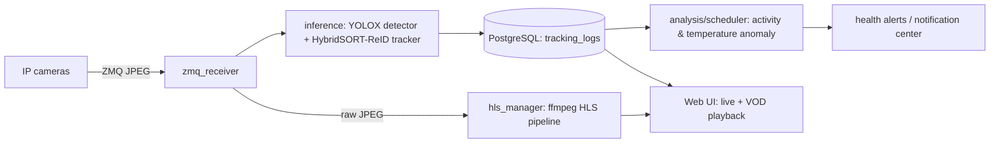

# pig-agri

[](https://github.com/esp8266good/pig-agri/actions/workflows/ci.yml)
[](LICENSE)

**Vision-based activity monitoring for pig welfare.** pig-agri watches each pig in a
pen through ordinary cameras, tracks how much every animal moves, and flags pigs whose
activity drops below the herd — the ones a vet should check or blood-test. The goal is
better animal welfare and fewer unnecessary blood draws. It is non-commercial research
software, currently **deployed and running on a working pig farm**.

## Why it matters

Deciding which pigs need a blood test is normally manual and invasive. pig-agri turns it
into a continuous, low-stress signal: persistently low movement relative to penmates is an
early indicator that an animal is unwell. Reliable per-animal tracking over hours is the
hard part, and it is exactly what this project is built around.

## How it works



Each pig keeps a stable track id; `analysis/scheduler.py` joins bbox-center displacement
per `object_id` into an activity rate (px/s) and compares each animal against the herd
median. Persistently low activity raises a health alert. A separate HLS pipeline serves
real-time and recorded video to a single-page web UI, with bboxes aligned to the footage.

## Features

- Real-time multi-object tracking tuned for long-occlusion robustness (ReID lost-track pool)
- Activity-based health anomaly detection with hysteresis to avoid alert flapping
- Optional thermal-camera temperature anomaly detection (toggleable)
- HLS live streaming + VOD playback with capture-time-aligned bounding boxes
- Notification center, bookmarks, segment protection, calendar timeline
- Storage resilience: write-failure protection, health monitoring, nightly ephemeral live

## Tech stack

Python 3.11 · FastAPI · PostgreSQL (asyncpg) · ZeroMQ · ffmpeg / HLS ·
YOLOX detector · HybridSORT-ReID tracker · uv · pytest

## Project status

Actively developed, **pre-publication research** (this system is the basis of the author's
thesis). The codebase is built spec-first: every feature has a design spec and an
implementation plan under [`docs/superpowers/specs`](docs/superpowers/specs) and
[`docs/superpowers/plans`](docs/superpowers/plans). The suite has **240+ tests**; CI runs
the external-dependency-free core subset on every push.

## Getting started

```bash
# 1. Install dependencies (uv)
uv sync --extra dev

# 2. Start PostgreSQL (schema in sql/init.sql)
docker compose up -d

# 3. Configure environment
cp .env.example .env   # then edit camera sources etc.

# 4. Run the app
uv run uvicorn main:app --host 0.0.0.0 --port 5005
```

The MOT tracker lives in the upstream **HybridSORT** project, which is an external
dependency cloned into `ref/HybridSORT/` (kept out of version control). The small set of
local modifications applied to it is documented in
[`docs/hybridsort-local-patches.md`](docs/hybridsort-local-patches.md).

## Repository layout

| Path | Responsibility |
|------|----------------|
| `inference/` | Detector + tracker pipeline, ReID feature extraction |
| `analysis/scheduler.py` | Activity / temperature anomaly detection |
| `hls_manager.py`, `vod_generator.py` | Live + recorded video (HLS) |
| `routers/` | FastAPI endpoints (stream, tracking, alerts, storage, settings) |
| `storage_monitor.py`, `hls_retention.py` | Storage health + retention |
| `static/index.html` | Single-page web UI |
| `tests/` | Test suite |
| `docs/superpowers/` | Design specs + implementation plans |

## Roadmap

- Reduce maintenance toil: broaden tests + CI, refactor for clarity, type coverage
- New capabilities: multi-camera support, stronger ReID, automated blood-draw reports
- Long-running stability: systematically verify and fix the resilience/sync backlog
- Reproducible research: documented, repeatable evaluation pipeline for the thesis

## Acknowledgements & third-party licenses

- [HybridSORT](https://github.com/ymzis69/HybridSORT) — MIT (bundles YOLOX and FastReID, both Apache-2.0)
- Built on FastAPI, OpenCV, ffmpeg, and the broader open-source ecosystem.

## License

[MIT](LICENSE) © LaZoark
