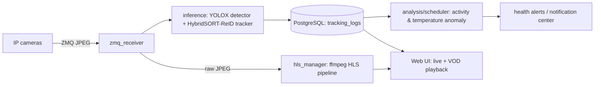

# pig-agri

[](https://github.com/esp8266good/pig-agri/actions/workflows/ci.yml)
[](LICENSE)

**Vision-based activity monitoring for pig welfare.** pig-agri watches each pig in a
pen through ordinary cameras, tracks how much every animal moves, and flags pigs whose
activity drops below the herd — the ones a vet should check or blood-test. The goal is
better animal welfare and fewer unnecessary blood draws. It is non-commercial research
software, currently **deployed and running on a working pig farm**.

## Why it matters

Deciding which pigs need a blood test is normally manual and invasive. pig-agri turns it
into a continuous, low-stress signal: persistently low movement relative to penmates is an
early indicator that an animal is unwell. Reliable per-animal tracking over hours is the
hard part, and it is exactly what this project is built around.

## How it works



Each pig keeps a stable track id; `analysis/scheduler.py` joins bbox-center displacement
per `object_id` into an activity rate (px/s) and compares each animal against the herd
median. Persistently low activity raises a health alert. A separate HLS pipeline serves
real-time and recorded video to a single-page web UI, with bboxes aligned to the footage.

## Features

- Real-time multi-object tracking tuned for long-occlusion robustness (ReID lost-track pool)
- Activity-based health anomaly detection with hysteresis to avoid alert flapping
- Focus list scoped to pigs currently on screen, so every listed id points at a visible box
- Optional thermal-camera temperature anomaly detection (toggleable)
- HLS live streaming + VOD playback with capture-time-aligned bounding boxes
- Notification center, bookmarks, segment protection, calendar timeline
- Storage resilience: write-failure protection, health monitoring, nightly ephemeral live
- Optional username/password authentication (off by default, `.env`-driven)

## Tech stack

Python 3.11 · FastAPI · PostgreSQL (asyncpg) · ZeroMQ · ffmpeg / HLS ·
YOLOX detector · HybridSORT-ReID tracker · uv · pytest

## Project status

Actively developed, **pre-publication research** (this system is the basis of the author's
thesis). The codebase is built spec-first: every feature has a design spec and an
implementation plan under [`docs/superpowers/specs`](docs/superpowers/specs) and
[`docs/superpowers/plans`](docs/superpowers/plans). The suite has **571 tests**; CI runs
the external-dependency-free core subset on every push.

## Getting started

```bash
# 1. Install dependencies (uv)
uv sync --extra dev

# 2. Start PostgreSQL (schema in sql/init.sql)
docker compose up -d

# 3. Configure environment
cp .env.example .env   # then edit camera sources, storage paths, worker threads

# 4. Run the app
uv run uvicorn main:app --host 127.0.0.1 --port 5005
```

The MOT tracker lives in the upstream **HybridSORT** project, which is an external
dependency cloned into `ref/HybridSORT/` (kept out of version control) together with the
~1.1 GB of model weights it needs. Nothing detects or tracks until those are in place. The
small set of local modifications applied to it is documented in
[`docs/hybridsort-local-patches.md`](docs/hybridsort-local-patches.md).

Deploying to a real machine — GPU/storage sizing, system packages, camera network
reachability, autostart, reverse proxy, and migrating data from an existing instance — is
covered end to end in [`docs/deployment.md`](docs/deployment.md), with day-to-day
operations in [`service-readme.md`](service-readme.md).

## Security

The deployed instance is reachable from the public internet behind a TLS-terminating
reverse proxy, so the security posture is part of the design rather than an afterthought.

**Authentication (optional, off by default).** Setting `AUTH_ENABLED=true` puts every API
route and the tracking WebSocket behind a session cookie; only `/health`, `/auth/*` and the
static assets stay public. Passwords are hashed with `hashlib.scrypt` and sessions are
stateless HMAC-SHA256-signed cookies (`HttpOnly`, `SameSite=Lax`, `Secure`), so no extra
dependency and no session table. Repeated failures lock a source IP out. Credentials and
the enable flag are read **only** from the environment, never from the database-backed
settings table — `PUT /settings` is one of the endpoints being protected, so a
database-backed switch could be flipped off by an unauthenticated caller. Setup steps are
in [`service-readme.md`](service-readme.md); `scripts/make_password_hash.py` generates the
values.

**Settings validation.** `PUT /settings` validates every value, not just the key name. Two
concrete holes this closes: `ntfy_url` is fetched server-side, so an unvalidated value made
the endpoint a server-side request forgery primitive — it now rejects non-HTTP(S) schemes
and any loopback, private, link-local or reserved address. And `hls_retention_days=0` made
the retention sweep treat every recording as expired and delete it within the hour, so
numeric settings now carry bounds matching the UI's own input limits.

**Other hardening.** PostgreSQL binds to loopback only (a published Docker port inserts
iptables rules that bypass the host firewall). Database access is fully parameterised, HLS
file serving resolves and containment-checks every path, and the web UI builds DOM nodes
with `textContent` rather than HTML interpolation.

**Where the app itself listens is a deployment decision, not a fixed property.** Binding to
loopback is the default and the safest posture: nothing can reach the app without going
through the reverse proxy's TLS and rate limiting. When the proxy runs on a *different*
host the app has to listen on an external interface, and the loopback guarantee is gone —
that deployment must pair the wider bind with either `AUTH_ENABLED=true` or a firewall rule
restricting the port to the proxy host. The trade-offs are laid out in
[`docs/deployment.md`](docs/deployment.md).

## Repository layout

| Path | Responsibility |
|------|----------------|
| `inference/` | Detector + tracker pipeline, ReID feature extraction |
| `analysis/scheduler.py` | Activity / temperature anomaly detection |
| `hls_manager.py`, `vod_generator.py` | Live + recorded video (HLS) |
| `routers/` | FastAPI endpoints (stream, tracking, alerts, storage, settings) |
| `storage_monitor.py`, `hls_retention.py` | Storage health + retention |
| `static/` | Single-page web UI (`index.html` + `css/` + `js/`, ES modules, zero build) |
| `auth.py`, `auth_middleware.py` | Optional session-cookie authentication |
| `scripts/` | Operational tooling (dedup, credential hashing, instance-to-instance migration) |
| `tests/` | Test suite |
| `docs/` | Deployment guide, incident handoffs, design specs + implementation plans |

## Roadmap

- Reduce maintenance toil: broaden tests + CI, refactor for clarity, type coverage
- New capabilities: multi-camera support, stronger ReID, automated blood-draw reports
- Long-running stability: systematically verify and fix the resilience/sync backlog
- Reproducible research: documented, repeatable evaluation pipeline for the thesis

## Acknowledgements & third-party licenses

- [HybridSORT](https://github.com/ymzis69/HybridSORT) — MIT (bundles YOLOX and FastReID, both Apache-2.0)
- Built on FastAPI, OpenCV, ffmpeg, and the broader open-source ecosystem.

## License

[MIT](LICENSE) © LaZoark
