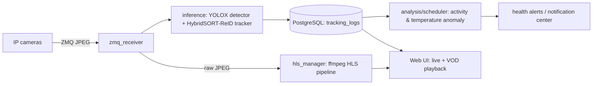

# Codex for OSS 申請 Implementation Plan

> **For agentic workers:** REQUIRED SUB-SKILL: Use superpowers:subagent-driven-development (recommended) or superpowers:executing-plans to implement this plan task-by-task. Steps use checkbox (`- [ ]`) syntax for tracking.

**Goal:** 把 `esp8266good/pig-agri` 補強成一個門面合格的開源專案（LICENSE / README / CONTRIBUTING / CoC / CI badge），並產出可直接複製貼上的 Codex for OSS 三題申請文案。

**Architecture:** 純文件 / 設定檔工作，無產品程式邏輯變動。新增頂層 `LICENSE`、`README.md`、`CONTRIBUTING.md`、`CODE_OF_CONDUCT.md`、`.github/workflows/ci.yml`，以及一份 `docs/codex-application-submission.md` 申請文案交付單。CI 只跑不依賴外部 `ref/HybridSORT` 與 DB 的純 Python 核心測試子集（9 檔、163 測試）以確保 badge 穩定綠燈。

**Tech Stack:** Markdown、GitHub Actions、uv、pytest、MIT License。

---

## 既有事實（執行前必讀，避免重工）

- **公開 repo 實際只有 82 個追蹤檔**。以下全部 **已 gitignored、不在公開 repo**：`ref/`（HybridSORT 整包）、`CLAUDE.md`、`_phist.txt`、`_docs/`、`tools/`、`uv.lock`、`.env`、`old/`。
  - ⇒ spec 的「A6 門面整理」**無需任何動作**：沒有雜訊外洩。使用者「不刪除、只移到 `old/`」的限制自然滿足（不需移動任何東西）。
  - ⇒ spec 的決策 D2（CLAUDE.md 處理）**無需動作**：它本來就不公開。
- HybridSORT (`ref/HybridSORT/`) 是 **MIT**，但**不在 repo**；它是外部相依，本地修改記錄於已追蹤的 `docs/hybridsort-local-patches.md`。README 必須誠實說明這點。
- `docs/superpowers/specs/` 與 `docs/superpowers/plans/`（含 Phase 1–6 與多個迭代）**已公開追蹤** → 這是 spec-driven 開發的最佳證據，README 要連過去。
- 測試：tracked tests 共 **247** 個 test function。CI 子集（無 `inference`/torch/DB 相依）= `test_alerts_router`(10) + `test_analysis_scheduler`(17) + `test_config`(13) + `test_database`(4) + `test_db_writer`(27) + `test_hls_manager`(46) + `test_hls_retention`(12) + `test_storage_monitor`(22) + `test_vod_generator`(12) = **163**。
- git author：`LaZoark`；email `claudepro200@gmail.com`；GitHub `esp8266good`。LICENSE 著作權人用 `LaZoark`（使用者可改真名）。
- 三題文案字數上限 **500 字元/題**，已驗證：Q1=490、Q2=467、Q3=419。

---

## Task 1: 新增 MIT LICENSE

**Files:**
- Create: `LICENSE`

- [ ] **Step 1: 寫入 MIT LICENSE 全文**

`LICENSE`：

```
MIT License

Copyright (c) 2026 LaZoark

Permission is hereby granted, free of charge, to any person obtaining a copy
of this software and associated documentation files (the "Software"), to deal
in the Software without restriction, including without limitation the rights
to use, copy, modify, merge, publish, distribute, sublicense, and/or sell
copies of the Software, and to permit persons to whom the Software is
furnished to do so, subject to the following conditions:

The above copyright notice and this permission notice shall be included in all
copies or substantial portions of the Software.

THE SOFTWARE IS PROVIDED "AS IS", WITHOUT WARRANTY OF ANY KIND, EXPRESS OR
IMPLIED, INCLUDING BUT NOT LIMITED TO THE WARRANTIES OF MERCHANTABILITY,
FITNESS FOR A PARTICULAR PURPOSE AND NONINFRINGEMENT. IN NO EVENT SHALL THE
AUTHORS OR COPYRIGHT HOLDERS BE LIABLE FOR ANY CLAIM, DAMAGES OR OTHER
LIABILITY, WHETHER IN AN ACTION OF CONTRACT, TORT OR OTHERWISE, ARISING FROM,
OUT OF OR IN CONNECTION WITH THE SOFTWARE OR THE USE OR OTHER DEALINGS IN THE
SOFTWARE.
```

- [ ] **Step 2: 確認檔案存在且非空**

Run: `test -s LICENSE && head -1 LICENSE`
Expected: 輸出 `MIT License`

- [ ] **Step 3: Commit**

```bash
git add LICENSE
git commit -m "docs: add MIT LICENSE"
```

---

## Task 2: 新增 README.md（門面）

**Files:**
- Create: `README.md`

- [ ] **Step 1: 寫入 README 全文**

`README.md`：

````markdown
# pig-agri

[](https://github.com/esp8266good/pig-agri/actions/workflows/ci.yml)
[](LICENSE)

**Vision-based activity monitoring for pig welfare.** pig-agri watches each pig in a
pen through ordinary cameras, tracks how much every animal moves, and flags pigs whose
activity drops below the herd — the ones a vet should check or blood-test. The goal is
better animal welfare and fewer unnecessary blood draws. It is non-commercial research
software, currently **deployed and running on a working pig farm**.

## Why it matters

Deciding which pigs need a blood test is normally manual and invasive. pig-agri turns it
into a continuous, low-stress signal: persistently low movement relative to penmates is an
early indicator that an animal is unwell. Reliable per-animal tracking over hours is the
hard part, and it is exactly what this project is built around.

## How it works



Each pig keeps a stable track id; `analysis/scheduler.py` joins bbox-center displacement
per `object_id` into an activity rate (px/s) and compares each animal against the herd
median. Persistently low activity raises a health alert. A separate HLS pipeline serves
real-time and recorded video to a single-page web UI, with bboxes aligned to the footage.

## Features

- Real-time multi-object tracking tuned for long-occlusion robustness (ReID lost-track pool)
- Activity-based health anomaly detection with hysteresis to avoid alert flapping
- Optional thermal-camera temperature anomaly detection (toggleable)
- HLS live streaming + VOD playback with capture-time-aligned bounding boxes
- Notification center, bookmarks, segment protection, calendar timeline
- Storage resilience: write-failure protection, health monitoring, nightly ephemeral live

## Tech stack

Python 3.11 · FastAPI · PostgreSQL (asyncpg) · ZeroMQ · ffmpeg / HLS ·
YOLOX detector · HybridSORT-ReID tracker · uv · pytest

## Project status

Actively developed, **pre-publication research** (this system is the basis of the author's
thesis). The codebase is built spec-first: every feature has a design spec and an
implementation plan under [`docs/superpowers/specs`](docs/superpowers/specs) and
[`docs/superpowers/plans`](docs/superpowers/plans). The suite has **240+ tests**; CI runs
the external-dependency-free core subset on every push.

## Getting started

```bash
# 1. Install dependencies (uv)
uv sync --extra dev

# 2. Start PostgreSQL (schema in sql/init.sql)
docker compose up -d

# 3. Configure environment
cp .env.example .env   # then edit camera sources etc.

# 4. Run the app
uv run uvicorn main:app --host 0.0.0.0 --port 5005
```

The MOT tracker lives in the upstream **HybridSORT** project, which is an external
dependency cloned into `ref/HybridSORT/` (kept out of version control). The small set of
local modifications applied to it is documented in
[`docs/hybridsort-local-patches.md`](docs/hybridsort-local-patches.md).

## Repository layout

| Path | Responsibility |
|------|----------------|
| `inference/` | Detector + tracker pipeline, ReID feature extraction |
| `analysis/scheduler.py` | Activity / temperature anomaly detection |
| `hls_manager.py`, `vod_generator.py` | Live + recorded video (HLS) |
| `routers/` | FastAPI endpoints (stream, tracking, alerts, storage, settings) |
| `storage_monitor.py`, `hls_retention.py` | Storage health + retention |
| `static/index.html` | Single-page web UI |
| `tests/` | Test suite |
| `docs/superpowers/` | Design specs + implementation plans |

## Roadmap

- Reduce maintenance toil: broaden tests + CI, refactor for clarity, type coverage
- New capabilities: multi-camera support, stronger ReID, automated blood-draw reports
- Long-running stability: systematically verify and fix the resilience/sync backlog
- Reproducible research: documented, repeatable evaluation pipeline for the thesis

## Acknowledgements & third-party licenses

- [HybridSORT](https://github.com/ymzis69/HybridSORT) — MIT (bundles YOLOX and FastReID, both Apache-2.0)
- Built on FastAPI, OpenCV, ffmpeg, and the broader open-source ecosystem.

## License

[MIT](LICENSE) © LaZoark
````

- [ ] **Step 2: 確認 mermaid/連結沒有壞掉的相對路徑**

Run: `test -s README.md && grep -c "docs/superpowers" README.md`
Expected: 數字 ≥ 2（specs 與 plans 兩個連結都在）

- [ ] **Step 3: Commit**

```bash
git add README.md
git commit -m "docs: add project README with architecture, status, roadmap"
```

---

## Task 3: 新增 CONTRIBUTING.md 與 CODE_OF_CONDUCT.md

**Files:**
- Create: `CONTRIBUTING.md`
- Create: `CODE_OF_CONDUCT.md`

- [ ] **Step 1: 寫入 `CONTRIBUTING.md`**

`CONTRIBUTING.md`：

```markdown
# Contributing to pig-agri

Thanks for your interest. pig-agri is research software maintained by a single author,
so contributions, bug reports, and questions are all welcome.

## Development setup

```bash
uv sync --extra dev          # install runtime + dev dependencies
docker compose up -d         # start PostgreSQL (schema: sql/init.sql)
uv run pytest                # run the test suite
```

The MOT tracker is an external dependency (HybridSORT) cloned into `ref/HybridSORT/`;
see `docs/hybridsort-local-patches.md` for the local modifications. Tests that do not
need the tracker run without it.

## How we work

- **Spec-first.** Non-trivial changes start with a design spec and an implementation plan
  under `docs/superpowers/specs` and `docs/superpowers/plans`.
- **Test-backed.** New behavior comes with tests; keep the suite green.
- **Small commits** with clear messages.

## Submitting changes

1. Fork and create a feature branch.
2. Make your change with accompanying tests.
3. Run `uv run pytest` and make sure it passes.
4. Open a pull request describing the change and the motivation.

## Reporting issues

Open a GitHub issue with steps to reproduce, expected vs. actual behavior, and your
environment. For security-sensitive reports, please contact the maintainer privately.
```

- [ ] **Step 2: 寫入 `CODE_OF_CONDUCT.md`（Contributor Covenant 精簡版）**

`CODE_OF_CONDUCT.md`：

```markdown
# Code of Conduct

## Our pledge

We as members, contributors, and maintainers pledge to make participation in this project
a harassment-free experience for everyone, regardless of age, body size, disability,
ethnicity, gender identity and expression, level of experience, nationality, personal
appearance, race, religion, or sexual identity and orientation.

## Our standards

Examples of behavior that contributes to a positive environment:

- Being respectful of differing viewpoints and experiences
- Giving and gracefully accepting constructive feedback
- Focusing on what is best for the community and the project

Unacceptable behavior includes harassment, insulting or derogatory comments, and
publishing others' private information without permission.

## Enforcement

Instances of abusive or otherwise unacceptable behavior may be reported to the project
maintainer. All complaints will be reviewed and investigated promptly and fairly.

This Code of Conduct is adapted from the [Contributor Covenant](https://www.contributor-covenant.org),
version 2.1.
```

- [ ] **Step 3: 確認兩檔存在**

Run: `test -s CONTRIBUTING.md && test -s CODE_OF_CONDUCT.md && echo OK`
Expected: 輸出 `OK`

- [ ] **Step 4: Commit**

```bash
git add CONTRIBUTING.md CODE_OF_CONDUCT.md
git commit -m "docs: add CONTRIBUTING and CODE_OF_CONDUCT"
```

---

## Task 4: 新增 GitHub Actions CI（綠燈 badge）

**Files:**
- Create: `.github/workflows/ci.yml`

**Background:** `ref/HybridSORT` 不在 repo，依賴它的測試在 CI 會 import 失敗；DB 相依測試在無 Postgres 的 runner 也會失敗。因此 CI 只跑「既有事實」列出的 9 個純 Python 檔（163 測試）。先在乾淨環境驗證子集全綠，再寫入 workflow。

- [ ] **Step 1: 在乾淨環境（無 .env）驗證子集全綠**

Run（模擬 CI：不載入專案 `.env`）：

```bash
env -u ZMQ_SOURCES -u ZMQ_STALE_MS bash -c '\
  uv run pytest \
    tests/test_alerts_router.py tests/test_analysis_scheduler.py \
    tests/test_config.py tests/test_database.py tests/test_db_writer.py \
    tests/test_hls_manager.py tests/test_hls_retention.py \
    tests/test_storage_monitor.py tests/test_vod_generator.py -q'
```

Expected: `163 passed`（若有個別檔失敗，從清單移除該檔，並在 Step 2 的 workflow 同步移除；記錄被移除的檔與原因）。

- [ ] **Step 2: 寫入 `.github/workflows/ci.yml`**

`.github/workflows/ci.yml`：

```yaml
name: CI

on:
  push:
    branches: [master]
  pull_request:

jobs:
  test:
    runs-on: ubuntu-latest
    steps:
      - uses: actions/checkout@v4

      - name: Install uv
        uses: astral-sh/setup-uv@v5
        with:
          enable-cache: true

      - name: Set up Python
        run: uv python install 3.11

      - name: Install dependencies
        run: uv sync --extra dev

      - name: Run core test suite
        run: >-
          uv run pytest
          tests/test_alerts_router.py
          tests/test_analysis_scheduler.py
          tests/test_config.py
          tests/test_database.py
          tests/test_db_writer.py
          tests/test_hls_manager.py
          tests/test_hls_retention.py
          tests/test_storage_monitor.py
          tests/test_vod_generator.py
          -q
```

- [ ] **Step 3: 驗證 workflow YAML 語法**

Run: `uv run python -c "import yaml,sys; yaml.safe_load(open('.github/workflows/ci.yml')); print('yaml ok')"`
Expected: 輸出 `yaml ok`

- [ ] **Step 4: Commit**

```bash
git add .github/workflows/ci.yml
git commit -m "ci: add GitHub Actions running the core test suite"
```

- [ ] **Step 5: Push 並確認 Actions 綠燈（使用者執行）**

說明：push 後到 GitHub Actions 頁面確認 workflow 變綠；README 的 CI badge 才會顯示綠色。
若紅燈，回 Step 1 找出失敗檔並從清單移除，重跑 Step 2–4。

---

## Task 5: 產出申請文案交付單（含 GitHub metadata 文字）

**Files:**
- Create: `docs/codex-application-submission.md`

- [ ] **Step 1: 驗證三題字數 ≤ 500**

Run:

```bash
python3 - <<'PY'
q1="pig-agri is a real-time computer-vision system deployed on a working pig farm: it tracks each pig's activity to flag animals needing veterinary blood tests, improving welfare and cutting unneeded draws. It's non-commercial research (my thesis basis). As sole maintainer I keep ~190 passing tests, practice spec-driven development, and document systematic debugging across 100+ commits. The repo is new so stars are low, but this is actively maintained, deployed production code, not a demo."
q2="As a solo maintainer, Codex would let one person responsibly sustain a full-stack real-time CV system: expanding the test suite and CI, refactoring for clarity, and reviewing my own diffs for code quality and security. It would accelerate features (multi-camera, stronger ReID, automated blood-draw reports) and help me systematically verify and fix the many long-running stability issues in my backlog, freeing scarce time for the underlying animal-welfare research."
q3="I'm one researcher, not a funded team, building this for animal welfare in agriculture, an underserved domain for AI tooling. The repo is young but the system is real and running on an actual farm. Codex wouldn't polish a popular library; it would let a single person maintain and document production code while completing the research it supports. Happy to share deployment details, demo footage, or a maintainer call."
for n,q in [("Q1",q1),("Q2",q2),("Q3",q3)]: print(n,len(q),"OK" if len(q)<=500 else "OVER")
PY
```

Expected: `Q1 490 OK` / `Q2 467 OK` / `Q3 419 OK`

- [ ] **Step 2: 寫入交付單**

`docs/codex-application-submission.md`：

````markdown
# Codex for OSS — Application Submission Sheet

Repo: https://github.com/esp8266good/pig-agri
Form: https://openai.com/form/codex-for-oss/ (requires ChatGPT login)

> Each answer is capped at 500 characters. Verified lengths: Q1=490, Q2=467, Q3=419.

## Q1 — Why does this repository qualify? (490)

pig-agri is a real-time computer-vision system deployed on a working pig farm: it tracks each pig's activity to flag animals needing veterinary blood tests, improving welfare and cutting unneeded draws. It's non-commercial research (my thesis basis). As sole maintainer I keep ~190 passing tests, practice spec-driven development, and document systematic debugging across 100+ commits. The repo is new so stars are low, but this is actively maintained, deployed production code, not a demo.

## Q2 — How will you use API credits for your project? (467)

As a solo maintainer, Codex would let one person responsibly sustain a full-stack real-time CV system: expanding the test suite and CI, refactoring for clarity, and reviewing my own diffs for code quality and security. It would accelerate features (multi-camera, stronger ReID, automated blood-draw reports) and help me systematically verify and fix the many long-running stability issues in my backlog, freeing scarce time for the underlying animal-welfare research.

## Q3 — Anything else we should know? (419)

I'm one researcher, not a funded team, building this for animal welfare in agriculture, an underserved domain for AI tooling. The repo is young but the system is real and running on an actual farm. Codex wouldn't polish a popular library; it would let a single person maintain and document production code while completing the research it supports. Happy to share deployment details, demo footage, or a maintainer call.

---

## GitHub repo settings (set manually on github.com → repo → About / ⚙)

**Description:**

> Real-time computer-vision system for pig farms: tracks each pig's activity to flag animals needing veterinary blood tests. Deployed, non-commercial research.

**Topics:**

`computer-vision` `object-tracking` `multi-object-tracking` `animal-welfare`
`precision-livestock-farming` `fastapi` `yolox` `agriculture` `hls`

---

## Pre-submit checklist

- [ ] LICENSE, README, CONTRIBUTING, CODE_OF_CONDUCT committed and visible on GitHub
- [ ] CI badge is green on the repo home page
- [ ] GitHub description + topics set (above)
- [ ] Signed in to the ChatGPT account used for the application
- [ ] Paste Q1–Q3, submit

## Honest expectations

The program weighs ecosystem importance and repository usage (stars/downloads), where this
repo is currently weak (new, 0 stars). This submission maximizes the controllable signals —
real deployment, disciplined maintenance, clear OSS hygiene — but approval is not guaranteed.
````

- [ ] **Step 3: 確認檔案存在**

Run: `test -s docs/codex-application-submission.md && echo OK`
Expected: 輸出 `OK`

- [ ] **Step 4: Commit**

```bash
git add docs/codex-application-submission.md
git commit -m "docs: add Codex for OSS application submission sheet"
```

---

## Self-Review（已執行）

- **Spec coverage：** A1 LICENSE→Task1；A2 README→Task2；A4 CONTRIBUTING/CoC→Task3；A5 CI+badge→Task4；A3 metadata 文字 + Part B 三題→Task5。A6 門面整理→「既有事實」已證實無需動作（雜訊已 gitignored），符合使用者「不刪除」限制。Part C 誠實底線→落實於 Q1（不造假 stars）與交付單的 Honest expectations 段。
- **Placeholder scan：** 無 TBD/TODO；所有檔案內容、指令、預期輸出皆完整。
- **Type/一致性：** repo slug `esp8266good/pig-agri`、port 5005、測試檔清單、字數（490/467/419）跨 Task 一致。
- **已知風險：** Task4 Step1 若有個別測試檔在乾淨環境失敗，依指示從清單移除即可（workflow 與驗證指令同步），不影響 badge 綠燈目標。
